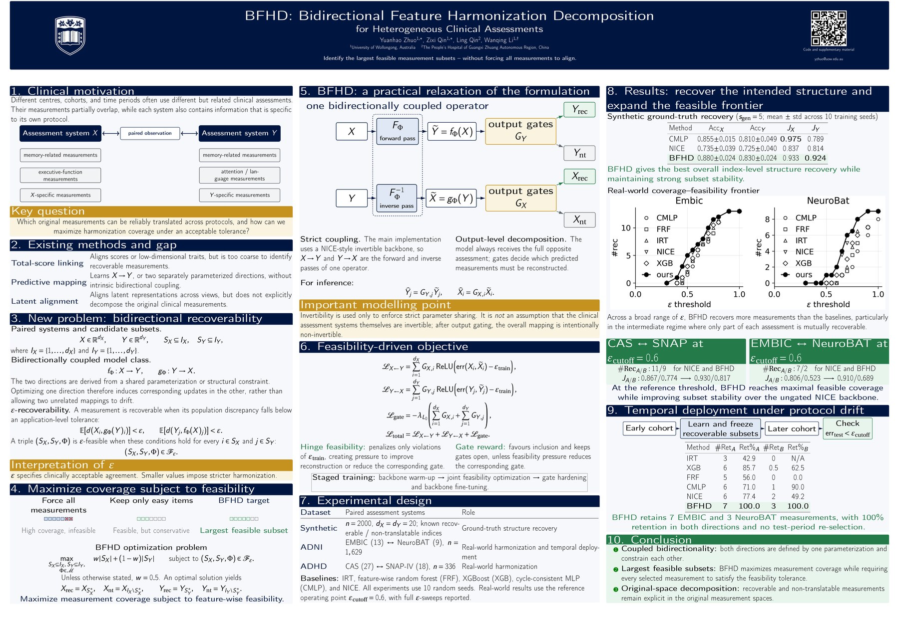

# BFHD: Bidirectional Feature Harmonization Decomposition

This repository provides code and supplementary technical materials for our IJCAI-ECAI 2026 paper:

**BFHD: Bidirectional Feature Harmonization Decomposition for Heterogeneous Clinical Assessments**

BFHD formulates clinical assessment harmonization as a bidirectional recoverability problem. Given paired observations from two heterogeneous assessment systems, the method identifies measurements that can be reliably translated in both directions under an application-defined feasibility tolerance, while separating non-translatable components.

**Project materials:** [Poster (PDF)](presentation/BFHD_IJCAI26_poster.pdf) · Presentation slides [slides (PDF)](presentation/slides.pdf)· Supplementary Technical Material *(next update)* 

## Poster

<p align="center">
  <a href="presentation/BFHD_IJCAI26_poster.pdf">
    
  </a>
</p>

<p align="center">
  <a href="presentation/BFHD_IJCAI26_poster.pdf"><strong>View / download the IJCAI-ECAI 2026 poster (PDF)</strong></a>
</p>

## Repository status

This repository is being progressively cleaned and expanded for the public research release. The current version contains the key implementation components required to reproduce the core BFHD mechanism, together with the synthetic data generator, conference poster, and presentation slides.

The official proceedings version of the paper is now available through IJCAI, including the final bibliographic metadata and DOI.

The next planned update is a reorganized version of the **Supplementary Technical Material**, followed by a cleaner and more complete preliminary research code release with expanded docstrings, configuration notes, and runnable usage documentation.

## Release roadmap / TODO

- [√] Release the repository scaffold and core BFHD implementation.
- [√] Release the synthetic data generator.
- [√] Add the IJCAI-ECAI 2026 poster (PDF + README preview).
- [√] Add the presentation slides (PDF) after the oral presentation.
- [√] Update the citation with the official proceedings metadata / DOI when available.
- [ ] Upload the reorganized **Supplementary Technical Material**.
- [ ] Release the cleaned preliminary full codebase for experiments that can be shared under the relevant data-use constraints.
- [ ] Expand docstrings, configuration descriptions, and runnable usage examples.

## Important note on data

This repository does **not** redistribute any subject-level clinical data, ADNI data, derived ADNI features, or other dataset files used in the paper.

### ADNI data

Experiments involving the Alzheimer's Disease Neuroimaging Initiative (ADNI) require users to obtain access through the official ADNI/LONI data access process. ADNI data access is managed through the Image & Data Archive (IDA) at LONI, and users must review and agree to the ADNI Data Use Agreement before accessing the data.

Relevant official links:

- ADNI data access page: https://adni.loni.usc.edu/data-samples/adni-data/
- ADNI Data Use Agreement / access application: https://ida.loni.usc.edu/collaboration/access/appApply.jsp?project=ADNI
- ADNI documentation: https://adni.loni.usc.edu/help-faqs/adni-documentation/
- ADNI acknowledgement list: http://adni.loni.usc.edu/wp-content/uploads/how_to_apply/ADNI_Acknowledgement_List.pdf

Researchers who wish to reproduce ADNI-based experiments should apply for ADNI access independently, comply with the ADNI Data Use Agreement, and run the provided code only on data that they are authorized to access locally.

When using ADNI data in a manuscript, users should also follow the official ADNI manuscript citation and acknowledgement requirements. In particular, ADNI requests that manuscripts using ADNI data include appropriate ADNI attribution language and refer to the complete ADNI investigator list.

### ADHD dataset

The ADHD-related dataset used in the paper is not redistributed in this repository. It is associated with the following study:

Fu, Y., Qin, Z., Qin, L., Zhang, H., Liu, H., Huang, S., & Li, D. (2025).  
Multidimensional factors associated with ADHD core symptoms in children: cognition, sleep, behavior, and demographics.  
*Frontiers in Psychiatry*, 16, 1658202.  
https://doi.org/10.3389/fpsyt.2025.1658202

For questions about access to this dataset, please contact the corresponding author of the above article.

Users are responsible for ensuring that any use of ADNI, ADHD-related, or other clinical data complies with the corresponding data-use agreements, ethical approvals, and institutional requirements.

## Supplementary Technical Material

A reorganized version of the Supplementary Technical Material will be uploaded in the next repository update. It will collect additional implementation details, hyperparameter settings, experimental protocols, and extended results in a cleaner reproducibility-oriented format.

- `supplementary.pdf`  *(to be added / updated)*

The supplementary material is provided as additional technical documentation for reproducibility. It is not an official IJCAI proceedings appendix unless explicitly allowed by the conference.

## Code structure

To be done.

The initial release focuses on the core BFHD components. Some project-specific training and data-processing code depends on access-controlled datasets or external project infrastructure and is therefore not included in this initial release.

## Usage

Example usage will be added as the repository is finalized.

## Citation

If you find BFHD useful in your research, please cite our paper:

```bibtex
@inproceedings{zhuo2026bfhd,
  title     = {BFHD: Bidirectional Feature Harmonization Decomposition for Heterogeneous Clinical Assessments},
  author    = {Zhuo, Yuanhao and Qin, Zixi and Qin, Ling and Li, Wanqing},
  booktitle = {Proceedings of the Thirty-Fifth International Joint Conference on
               Artificial Intelligence, {IJCAI-26}},
  publisher = {International Joint Conferences on Artificial Intelligence Organization},
  pages     = {7046--7054},
  year      = {2026},
  doi       = {10.24963/ijcai.2026/784},
}
```

## Contact

For questions about the code or implementation, please open an issue in this repository.
